# 🚀 Event-Driven Retail Operations Pipeline on AWS
Keywords:
AWS • Terraform • EventBridge • Lambda • DynamoDB • S3 • Athena • Glue • SNS • CloudWatch • Serverless • Event-Driven Architecture


A production-style **event-driven retail operations platform** built using **AWS Serverless Services, Terraform, and Python**. The solution processes inventory and fuel pricing events in real time, stores operational data, archives events into a data lake, generates business alerts, and enables SQL analytics using Amazon Athena.

---

# 📌 Project Summary

- Infrastructure as Code using Terraform
- 15+ AWS resources provisioned automatically
- Fully Serverless Architecture
- Event-Driven Processing
- Real-Time Inventory Monitoring
- Fuel Pricing Analytics
- Automatic SNS Alerting
- Amazon S3 Data Lake
- Amazon DynamoDB Operational Database
- AWS Glue Data Catalog
- Amazon Athena Analytics
- Amazon CloudWatch Monitoring Dashboard

---

# 🏢 Business Problem

Retail companies generate thousands of inventory and fuel pricing updates every day across multiple stores. Traditional batch processing introduces delays, making it difficult to detect:

- Low inventory
- Fuel price changes
- Competitor pricing differences
- Operational issues

This project demonstrates how an AWS event-driven architecture enables near real-time processing, monitoring, alerting, and analytics for retail operations.

---

# 🏗 Solution Architecture

```text
                    Retail Operations Application
                                 │
                                 ▼
                      Amazon EventBridge
                                 │
                                 ▼
                         Event Routing Rules
                                 │
                 ┌───────────────┴───────────────┐
                 ▼                               ▼
      Inventory Events Queue          Pricing Events Queue
                 │                               │
                 ▼                               ▼
        Inventory Lambda               Pricing Lambda
                 │                               │
        ┌────────┴────────┐             ┌────────┴────────┐
        ▼                 ▼             ▼                 ▼
 Amazon DynamoDB      Amazon S3     Amazon DynamoDB   Amazon S3
 Operational DB       Data Lake     Operational DB    Data Lake
        │                 │               │               │
        └─────────────────┴───────────────┴───────────────┘
                                  │
                                  ▼
                           AWS Glue Catalog
                                  │
                                  ▼
                           Amazon Athena
                                  │
                                  ▼
                     Amazon CloudWatch Dashboard

                 Amazon SNS Alerts
        • Low Inventory Notifications
        • Fuel Pricing Gap Alerts
```

---

# 🎯 Project Workflow

1. Retail application publishes inventory and pricing events.
2. Amazon EventBridge routes events based on event type.
3. Amazon SQS buffers events for reliable processing.
4. AWS Lambda processes each event asynchronously.
5. Processed data is stored in Amazon DynamoDB.
6. Event payloads are archived in Amazon S3.
7. AWS Glue catalogs archived data.
8. Amazon Athena enables SQL analytics.
9. Amazon SNS sends business alerts.
10. Amazon CloudWatch monitors the entire pipeline.

---

# 📊 Key Metrics

| Metric | Value |
|---------|------:|
| AWS Services Used | 10+ |
| Terraform Modules | 8+ |
| Lambda Functions | 2 |
| Event Types | 2 |
| SQS Queues | 2 |
| Dead Letter Queues | 2 |
| CloudWatch Dashboard | 1 |
| SNS Topics | 1 |

---

# ⚙ AWS Services Used

| AWS Service | Purpose |
|-------------|---------|
| Amazon EventBridge | Event Routing |
| Amazon SQS | Queue Buffering |
| AWS Lambda | Serverless Event Processing |
| Amazon DynamoDB | Operational Database |
| Amazon S3 | Data Lake Storage |
| AWS Glue | Metadata Catalog |
| Amazon Athena | SQL Analytics |
| Amazon SNS | Business Alerts |
| Amazon CloudWatch | Monitoring & Dashboards |
| AWS IAM | Security & Permissions |

---

# 📂 Project Structure

```text
event-driven-retail-operations-pipeline/

├── terraform/
│   ├── env/
│   └── modules/
│
├── src/
│   ├── event_generator/
│   ├── inventory_processor/
│   └── pricing_processor/
│
├── screenshots/
│
├── README.md
│
└── requirements.txt
```

---

# ✨ Features

## Infrastructure as Code

- Modular Terraform configuration
- Automated AWS infrastructure provisioning
- Environment-specific deployments

## Event-Driven Processing

- Inventory Event Pipeline
- Pricing Event Pipeline
- Asynchronous processing using Amazon SQS

## Serverless Computing

- AWS Lambda
- Amazon EventBridge
- Amazon SQS

## Data Storage

- Amazon DynamoDB operational database
- Amazon S3 event archive

## Analytics

- AWS Glue Data Catalog
- Amazon Athena SQL queries

## Monitoring & Alerting

- Amazon CloudWatch Dashboard
- Lambda Metrics
- Queue Monitoring
- SNS Notifications
- Dead Letter Queues (DLQs)

---

# 🚀 Deployment

Initialize Terraform

```bash
terraform init
```

Review Infrastructure

```bash
terraform plan
```

Deploy Infrastructure

```bash
terraform apply
```

Generate Sample Events

```bash
python3 src/event_generator/generate_events.py
```

---

# 📊 Sample Athena Query

```sql
SELECT
    store_id,
    COUNT(*) AS low_inventory_events
FROM inventory_events
WHERE inventory_remaining <= threshold
GROUP BY store_id
ORDER BY low_inventory_events DESC;
```

---

## 📸 Screenshots
# 📸 Screenshots

The following screenshots demonstrate the deployed AWS infrastructure and successful end-to-end event processing.

---

## Architecture

### Overall Solution Architecture
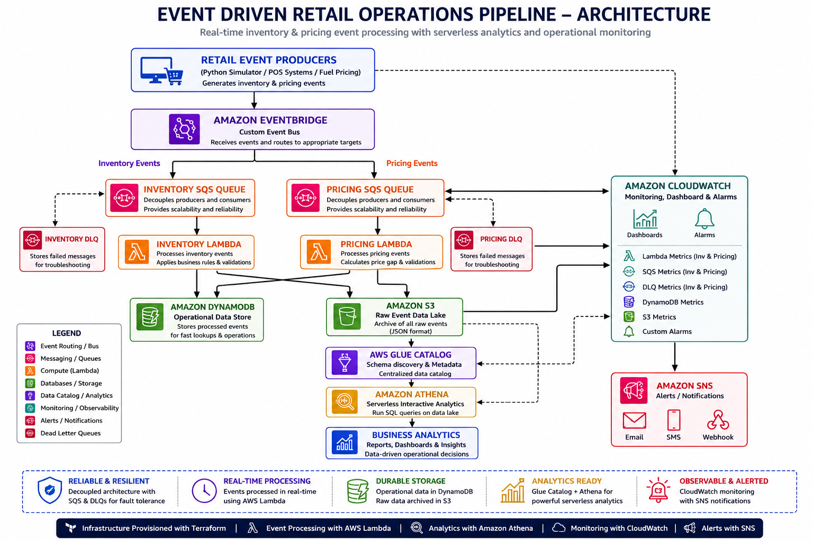

---

## Event Processing

### Amazon EventBridge Rules
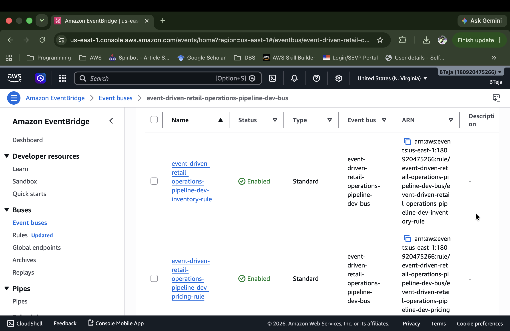

### Amazon SQS Queues
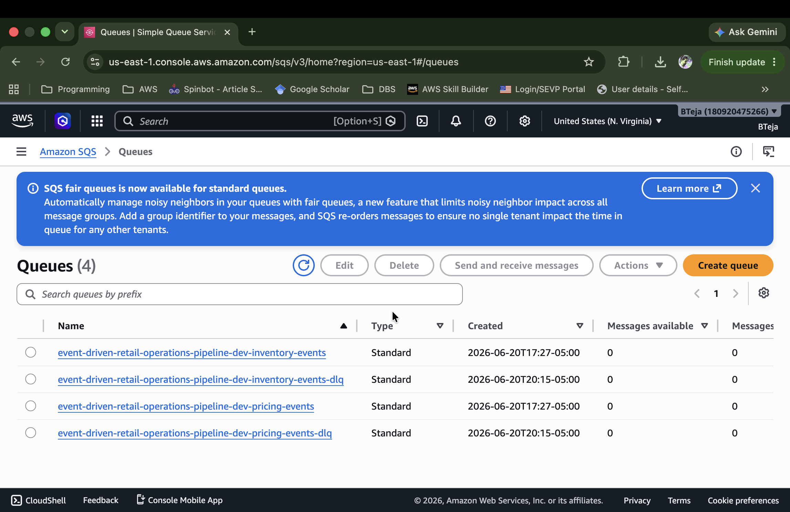

### AWS Lambda Functions
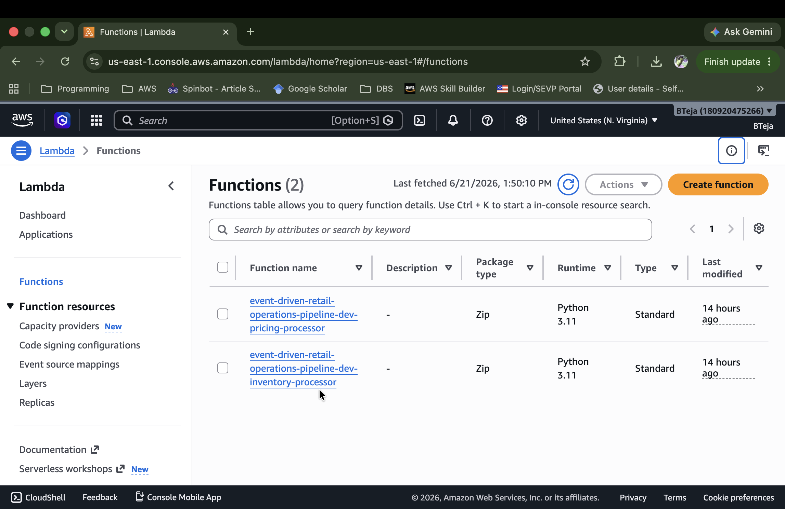

### Inventory Processor Logs
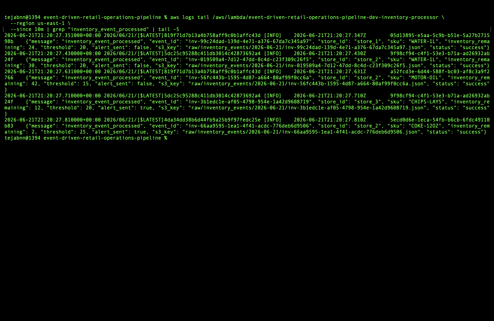

### Pricing Processor Logs
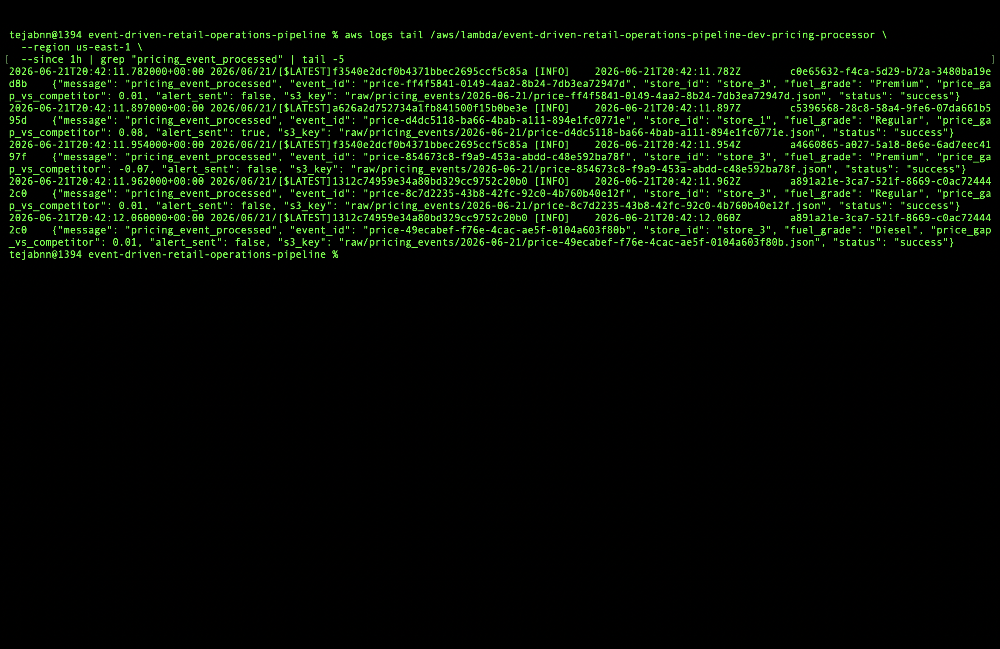

---

## Data Storage

### Amazon DynamoDB
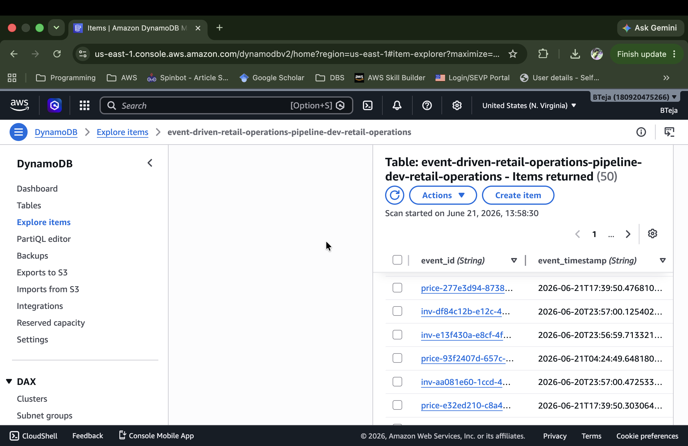

### Amazon S3 Event Archive
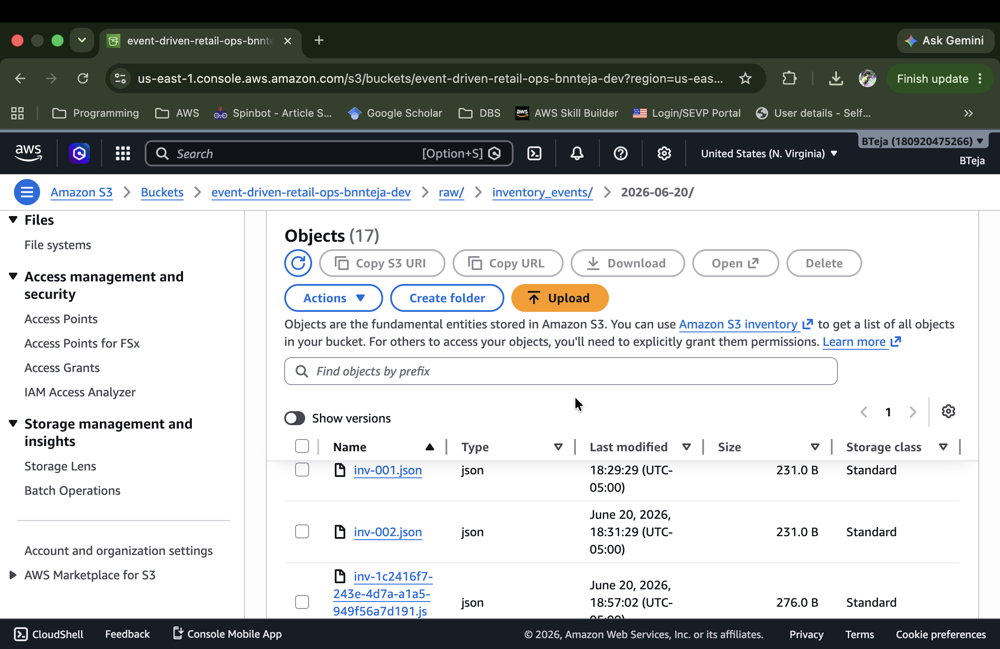

---

## Analytics

### AWS Glue Data Catalog
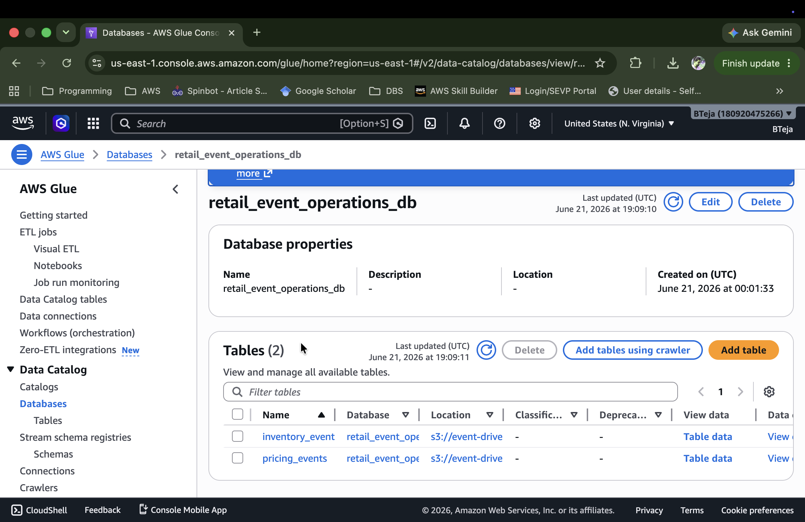

### Amazon Athena Query Results
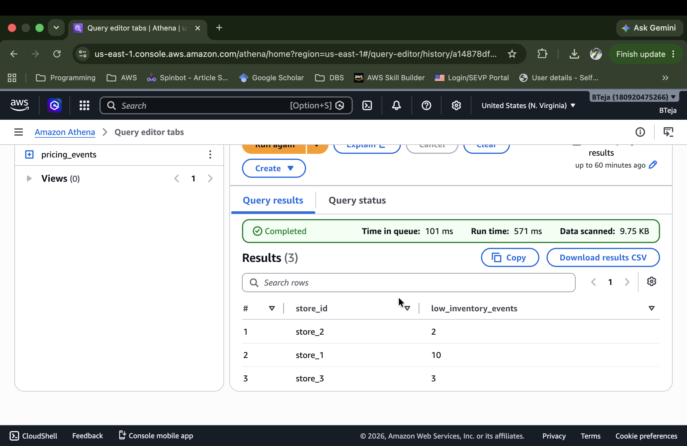

---

## Monitoring

### Amazon CloudWatch Dashboard
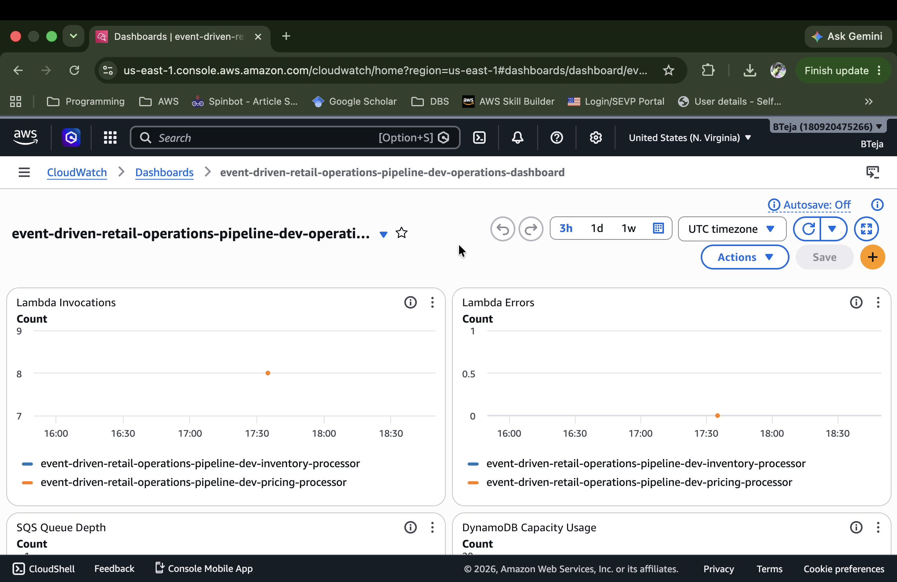

---

# 📈 Results

- Successfully processed multiple retail events during testing
- Real-time event processing
- Automatic inventory monitoring
- Fuel pricing analytics
- Serverless architecture
- DynamoDB operational storage
- Amazon S3 event archival
- Athena SQL analytics
- CloudWatch monitoring dashboard
- SNS alert notifications

---

# 🛠 Skills Demonstrated

## AWS
- EventBridge
- Lambda
- SQS
- DynamoDB
- S3
- Glue
- Athena
- SNS
- CloudWatch
- IAM

## Infrastructure
- Terraform
- Infrastructure as Code

## Programming
- Python
- JSON

## Architecture
- Event-Driven Systems
- Serverless Computing
- Cloud Monitoring

---

# 💡 Future Improvements

- Amazon Kinesis Data Streams
- AWS Step Functions
- AWS Glue ETL Jobs
- Apache Spark Processing
- Amazon QuickSight Dashboards
- GitHub Actions CI/CD
- Automated Testing Pipeline
- Multi-Region Deployment

---
 
# 📄 Resume Highlights

- Designed and deployed a production-style serverless event-driven retail platform on AWS using Terraform.
- Built asynchronous event processing pipelines using Amazon EventBridge, Amazon SQS, and AWS Lambda.
- Implemented operational data storage in Amazon DynamoDB and event archival in Amazon S3.
- Developed analytics using AWS Glue and Amazon Athena for SQL-based business reporting.
- Configured Amazon SNS notifications and Amazon CloudWatch dashboards for operational monitoring.

---

# 👨‍💻 Author

**Teja Boggu**

Cloud & Data Engineer

**Skills:** AWS • Terraform • Python • Serverless • Event-Driven Architecture • Cloud Infrastructure • Data Engineering

# 📜 License

This project is licensed under the MIT License.

See the [LICENSE](LICENSE) file for details.